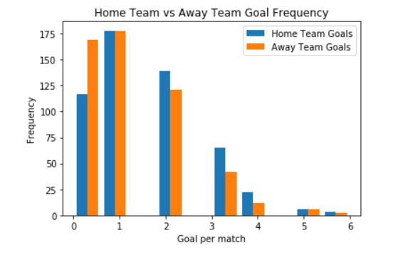
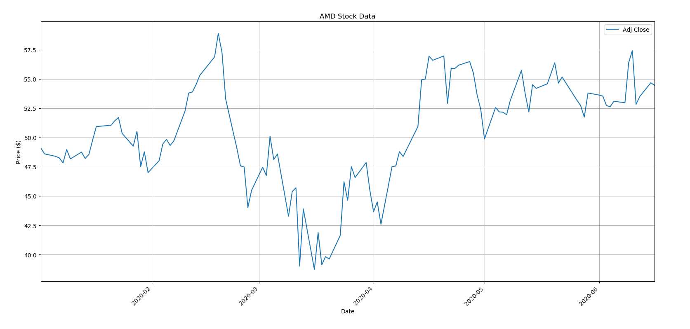
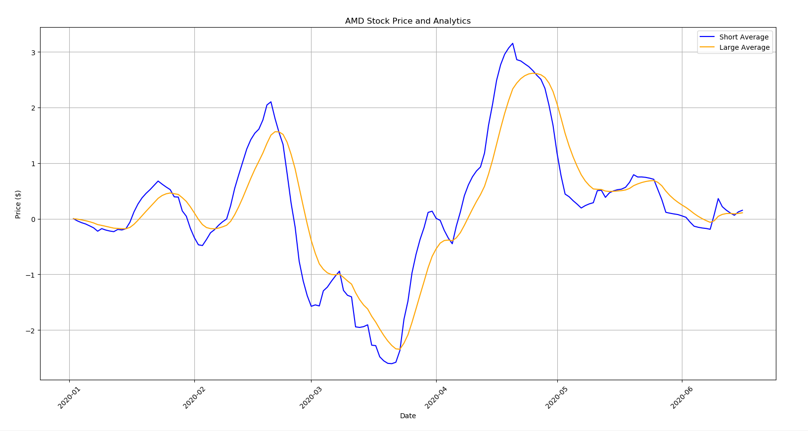
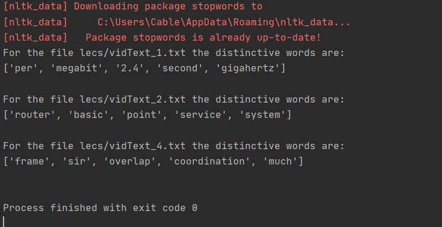

# Welcome to my Portfolio

My name is Santiago Guada and I am a third-year Computer Engineering undergraduate student at Purdue University from Venezuela with a great interest in Software Development, Data Science, and Machine Learning. I'm passionate about doing projects that challenge me and make me learn new concepts. I'm seeking an internship to apply and expand my knowledge to become a better professional.

I'm a great believer that hard work pays off, that's why I'm always trying to improve and learn new things that help me achieve my goals.

### [Predicting Premier League Results](https://github.com/sguadav/Predicting_soccer_results)

- Created a program that estimates the exact result of a soccer match, using the data from previous matches and some factors that might influence the game, with Supervised Learning and estimate the overall result of the match.
- Optimized the best model with Linear, Lasso, and Random Forest Regressors using GridsearchCV.
- Using the 2013 Premier League season, separated between train and test, the accuracy of the exact result was of 45% and the overall result of the match (win/draw/loss) was 95%.

### [Automatic Attendance Tracking System with OpenCV](https://github.com/sguadav/Face_recognition)
- Uses OpenCV to detect faces location on a webcam consistently
- Compares a folder of JPG pictures to the Web Cam connected to the computer using face location and encoding
- Analyzes whether the person in the Web Cam is in the folder of images
- Counts the person's attendance when recognized by the program in a CSV file

gg

### [Stock Market Interactive Portfolio](https://github.com/sguadav/My_Stock_Portfolio)
- Interactive program that maintains a stock portfolio on a CSV file
- Can explore other stocks, calculate the intrinsic value, and see the graph of the stock price and the MACD up-to-date
- Performs financial analysis on individual stocks, showing the current earnings.

### [Important Words in Group of Texts](https://github.com/sguadav/Distinctive_Words_Docs)
- Program that uses the Term Frequency-Inverse Document Frequency (TF-IDF) numerical statistic analysis to find the 5 most distinctive words between a list of txt files.
- Used to see how two files differenciate each other and have a summary in 5 words about it.

### [My Website](https://github.com/sguadav/My_Website)
- Created a Personal Website to promote myself using Django, HTML, and CSS
- Currently not uploaded and with much text

